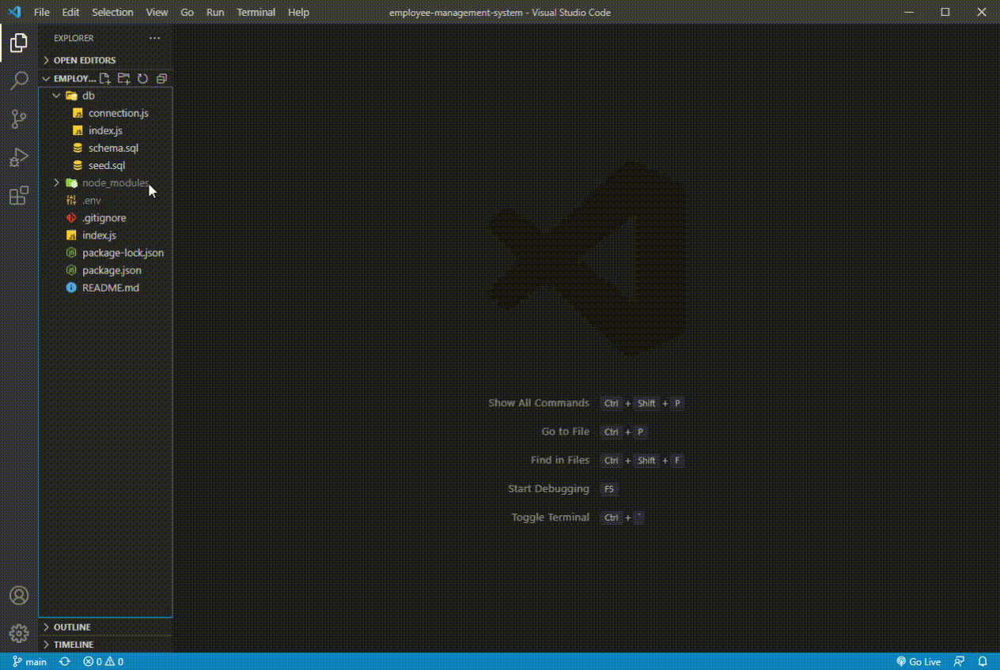

# Employee-Management-System

## Description
The Employee-Management-System provides a solution for managing a company's employees and their position. This command-line application takes inputs from a user to build out a database of departments, roles, and employees. User can create new departments, roles, and emplyees, view a list of those items, and 
update employee roles.

## Installations
1. Run in mySQL workbench to create database and table
2. Run npm install from command line
3. Run node index.js to launch application

## Usage
- add departments, roles, and employees
- view departments, roles, and employees
- update employee roles

## Walkthrough

 
